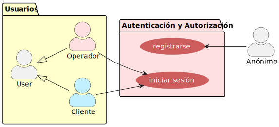
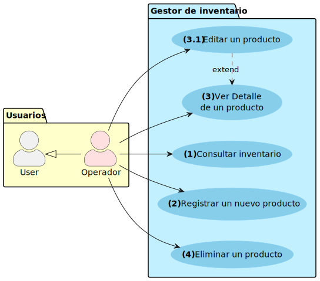
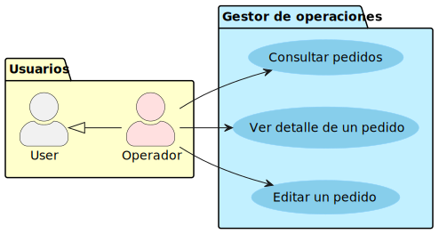
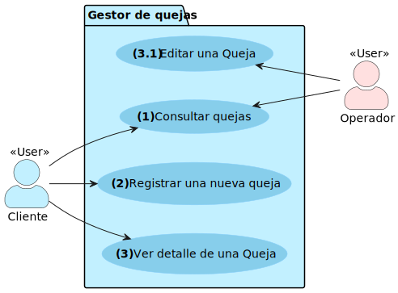

# Lacandon

## Diagrama de contexto para la plataforma

Un Diagrama de Contexto de Sistema (DCS) en Ingeniería de software e Ingeniería de sistemas es un diagrama que define los límites entre el sistema, o parte del sistema, y su ambiente, mostrando las entidades que interactúan con él.2​ Este diagrama es una vista de alto nivel de un sistema.

A continuación se muestra el diagrama de contexto para **Lacandon**:

```mermaid
    C4Context
      Person(Cliente, "Cliente")
      Person(Operador, "Operador")
      
      Enterprise_Boundary(b0, "Plataforma Lacandon") {

        System(Auth, "Autenticación y<br> Autorización")
        System(GestorVentas, "Gestor de<br> ventas")
        System(GestorOperaciones, "Gestor de<br> operaciones")
        System(GestorQuejas, "Gestor de<br> quejas")
        System(GestorInventario, "Gestor de<br> inventario")
        System(GestorProveedores, "Gestor de<br> proveedores")

        UpdateElementStyle(Auth, $bgColor="red")
      }

```

Funcionalidades del **Cliente**

```mermaid
    C4Context
      Person(Cliente, "Cliente")
      
      Enterprise_Boundary(b0, "Plataforma Lacandon") {

        System(Auth, "Autenticación y<br> Autorización")
        System(GestorVentas, "Gestor de<br> ventas")
        System(GestorQuejas, "Gestor de<br> quejas")

        Rel(Cliente, Auth, "iniciar sesión")
        Rel(Cliente, GestorVentas, "Comprar productos")
        Rel(Cliente, GestorQuejas, "Registrar quejas")

        UpdateElementStyle(Auth, $bgColor="red")
        UpdateRelStyle(Cliente, GestorVentas, $offsetX="-50", $offsetY="50")
        UpdateRelStyle(Cliente, GestorQuejas, $offsetX="200", $offsetY="87")

      }

```

## Casos de uso

Los casos de uso son

### Autenticación y autorización



### Gestor de proveedores


### Gestor de inventario




### Gestor de Ventas


### Gestor de operaciones




### Gestor de quejas




## Modelo de dominio

Un modelo de dominio es una representación de los conceptos, reglas y relaciones que definen un dominio de problema.

En la siguiente figura, se muestra el modelo de dominio simplificado para la plataforma **Lacandon**:


```mermaid

%%{
  init: {
    'theme': 'base',
    'themeVariables': {
      'primaryColor': 'white',
      'primaryTextColor': 'black',
      'primaryBorderColor': 'black',
      'lineColor': 'black'
    }
  }
}%%
classDiagram

    Usuario -- "1..*" Carrito: tiene
    Usuario --> "1..*" Queja: registra
    Usuario --> "1..*" Rol
    Carrito --> EstadoCarrito
    Carrito -- "1..*" RegistroProducto
    RegistroProducto "1..*" -- Producto
    Queja --> EstadoQueja
    Producto --> Categoria

    class Usuario {
        String login
        String email
        String password
        String firstName
        String lastName
        List~ Rol~  roles
    }
    class EstadoCarrito {
        <<Enumeración>>
        CREADO
        SOLICITADO
        RECHAZADO
        ENTREGADO
    }

    class Queja {
        Long id
        String descripcion
        String comentarios
        EstadoQueja estado
    }

    class EstadoQueja{
        <<Enumeración>>
        REGISTRADA
        ASIGNADA
        RECHAZADA
        CERRADA
    }

    class Carrito {
        Long id
        Long usuarioId
        Instant fechaCreacion
        EstadoCarrito estado

    }

    class RegistroProducto {
        <<Asociación>>
        Long carritoId
        Long productoId
    }

    class Producto {
        <<Catálogo>>
        Long id
        String nombre
        String descripcion
        Double precio 
        Blob imagen
        String contentType
        Long cantidad
    }

    class Categoria {
        <<Enumeración>>
        ALIMENTOS
        TECNOLOGIA
        ROPA_Y_ZAPATERIA
        MASCOTAS
        FARMACIA
        JUGUETERIA
    }

    class Rol {
        <<Enumeración>>
        USUARIO
        OPERADOR
    }
```

## Diagrama de estados

El diagrama de estados es un diagrama de comportamiento usado para especificar el comportamiento de una parte del sistema diseñado a través de transiciones de estados finitos. Es utilizado para mostrar los estados por los que pasa un componente de un sistema de información.

### Diagrama de estados para el carrito de compra

A continuación se muestra el diagrama de estados para el Objeto **Carrito de Compra**

```mermaid
%%{
  init: {
    'theme': 'base',
    'themeVariables': {
      'primaryColor': 'white',
      'primaryTextColor': 'black',
      'primaryBorderColor': 'black',
      'lineColor': 'black'
    }
  }
}%%
stateDiagram
    state "Administración del carrito de compra" as Carrito
    state Carrito {
        [*] --> CREADO
        CREADO --> SOLICITADO: enviar
        SOLICITADO --> RECHAZADO: rechazar
        SOLICITADO --> ENTREGADO: entregado
        RECHAZADO --> SOLICITADO: enviar
        ENTREGADO --> [*]

    }
```

### Diagrama de estados para la administración de una queja

A continuación se muestra el diagrama de estados para el Objeto **Queja**

```mermaid
%%{
  init: {
    'theme': 'base',
    'themeVariables': {
      'primaryColor': 'white',
      'primaryTextColor': 'black',
      'primaryBorderColor': 'black',
      'lineColor': 'black'
    }
  }
}%%
stateDiagram
    state "Administración de una queja" as Queja
    state Queja {
        [*] --> REGISTRADA
        REGISTRADA --> ASIGNADA: asignar
        REGISTRADA --> RECHAZADA: rechazar
        ASIGNADA --> RECHAZADA: rechazar
        ASIGNADA --> ATENDIDA: resuelta
        ATENDIDA --> [*]

    }
```


```plantuml
@startuml
    skinparam backgroundColor #EEEBDC
    skinparam handwritten true
    actor Customer
    Customer -> "login()" : username & password
    "login()" -> Customer : session token
    activate "login()"
    Customer -> "placeOrder()" : session token, order info
    "placeOrder()" -> Customer : ok
    Customer -> "logout()"
    "logout()" -> Customer : ok
    deactivate "login()"
@enduml