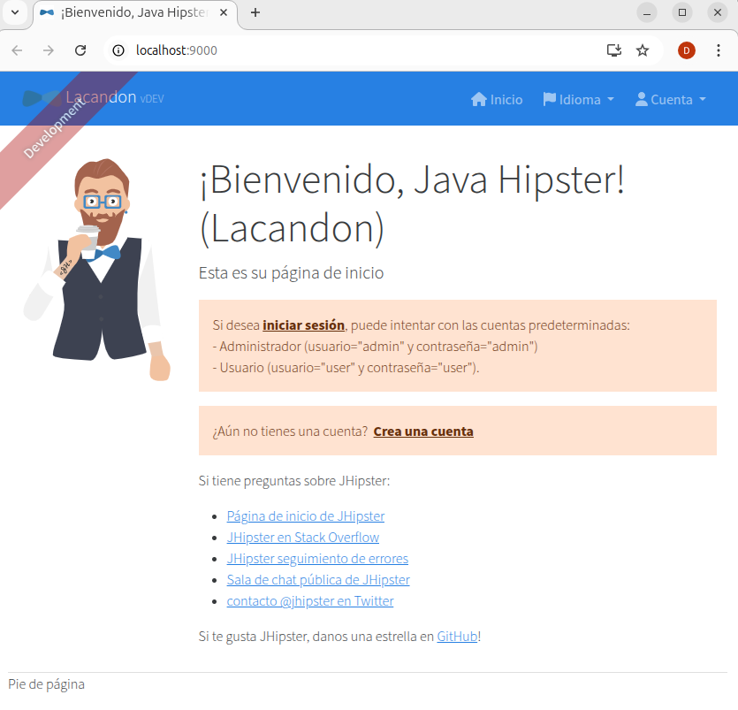

# Implementación

## Pre-requisitos

Antes de comenzar, deberás de verificar que tienes instalados los siguientes elementos:

- [Open JDK 17](https://openjdk.org/projects/jdk/17/) o mayor
- [Docker](https://www.docker.com/get-started/) _(Opcional)_
- [Git](https://git-scm.com/downloads)
- [VSCode](https://code.visualstudio.com/download)
- [Node 22.14.0 y NPM 10.9.2](https://nodejs.org/en) o superior
  - [Utilizar NVM](https://github.com/nvm-sh/nvm) _(Opcional)_
- [PosgreSQL](https://www.postgresql.org/download/) _(Opcional si tienes docker)_
- Algún cliente Rest como: [Insomnia](https://insomnia.rest/), [Postman](https://www.postman.com/) o [CURL](https://curl.se/)

Siempre hay que instalar la **versión LTS** de cada componente.

## Instalación de JHIPSTER

[Jhipster](https://www.jhipster.tech/) es un framework de desarrollo para la generación de código que, como herramienta y base de código, ayudan a ahorrar mucho tiempo en el desarrollo de proyectos. Jhipster genera aplicaciones con los frameworks más populares de desarrollo frontend y backend de la actualidad. Su proyecto se basa en el código abierto e integra componentes como Spring Boot, AngularJS o Bootstrap, que son imprescindibles a la hora de crear aplicaciones web modernas y aplicaciones basadas en microservicios.

Para instalar Jhipster, debe ejecutar el siguiente comando:

```shell
npm install -g generator-jhipster
```

## Descargar el proyecto desde Github

En alguna ruta de tu máquina local, crea una carpeta llamada `bootcamp` y colocate en ella, por ejemplo: `/home/daniel/bootcamp`.

Descargar el proyecto lacandon con el siguiente comando:

```shell
git clone https://github.com/calmecac-community/lacandon.git
```

Cambiate al nuevo directorio con el comando:

```shell
cp lacandon
```

!Listo!

## Levantar la base de datos PostgreSQL

jdbc:postgresql://localhost:5432/lacandon
Asegurate que tienes instalada, en tu máquina local, la base de datos `PostgreSQL` y escuchando por el puerto `5432`

> **Utilizar Docker _(Opcional)_**
>
> Sí tienes instalado `Docker`, puedes utilizar la versión de postgreSQL que viene en el archivo `postgresql.yml` y levantar la base de datos con el siguiente comando: `docker compose -f src/main/docker/postgresql.yml up -d`

## Levantar el proyecto

El proyecto consta de dos principales componentes: **Backend **y **Frontend**.

### Levantar el backend

Ejecuta el siguiente comando:

```
./mvnw
```

Si todo resulta bien, en la consola deberá de ver una salida parecida a la siguiente:

```shell
2025-03-10T12:39:17.917-06:00  INFO 55537 --- [  restartedMain] mx.calmecac.lacandon.LacandonApp         :
----------------------------------------------------------
        Application 'lacandon' is running! Access URLs:
        Local:          http://localhost:8080/
        External:       http://127.0.1.1:8080/
        Profile(s):     [dev, api-docs]
----------------------------------------------------------
```

A partir de ahora, puedes acceder al API del proyecto en la URL `http://localhost:8080/`

### Levantar el frontend

Abre una nueva terminal en la ruta que se encuentra el proyecto (ejemplo, `/home/daniel/bootcamp/lacandon`) y ejecuta el siguiente comando:

```shell
./npmw start
```

Si todo sale bien, podrás ver el proyecto en un navegador web en la ruta:

http://localhost:9000/



Intenta iniciar sesión con las siguientes credenciales:

```shell
usuario: admin
password: admin
```

# :tada: !Felicidades!

Has logrado terminar la primera actividad del proyecto final.
